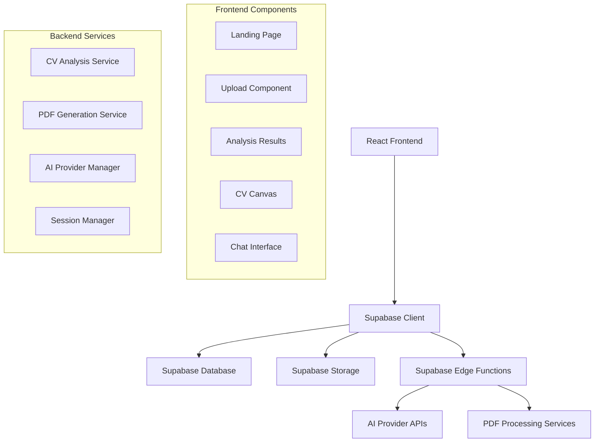

# Design Document

## Overview

The AI-powered CV Improvement Platform is a serverless React application that leverages Supabase for backend services and multiple AI providers for CV analysis and enhancement. The system follows a modular architecture with clear separation between frontend components, backend services, and external integrations.

The platform operates without user authentication, using session-based tracking to maintain user state throughout the CV improvement process. The application provides real-time feedback, interactive editing capabilities, and seamless PDF processing.

## Architecture

### High-Level Architecture



### Technology Stack

- **Frontend**: React 18 with Vite, TypeScript for type safety
- **Styling**: Tailwind CSS for responsive design
- **State Management**: Zustand for lightweight state management
- **PDF Handling**: react-pdf for display, pdf-lib for generation
- **Backend**: Supabase (PostgreSQL, Storage, Edge Functions)
- **AI Integration**: OpenAI API (primary), extensible to other providers
- **File Processing**: Supabase Storage with bucket-based organization

## Components and Interfaces

### Frontend Components

#### 1. Landing Page Component (`LandingPage.tsx`)
- **Purpose**: Welcome users and initiate CV upload process
- **Props**: None
- **State**: Upload progress, error states
- **Key Features**:
  - Hero section with platform explanation
  - Drag-and-drop file upload zone
  - File validation (PDF only, size limits)
  - Session ID generation and storage

#### 2. Upload Component (`UploadZone.tsx`)
- **Purpose**: Handle file upload with validation and progress tracking
- **Props**: `onUploadComplete: (fileData) => void`
- **State**: Upload progress, validation errors, file metadata
- **Key Features**:
  - Drag-and-drop and click-to-select functionality
  - Real-time upload progress indication
  - File type and size validation
  - Integration with Supabase Storage

#### 3. Analysis Results Component (`AnalysisResults.tsx`)
- **Purpose**: Display AI analysis results in organized cards
- **Props**: `analysisData: AnalysisResult`, `onSectionEdit: (section) => void`
- **State**: Section editing states, score updates
- **Key Features**:
  - Overall score display with visual indicators
  - Section cards with color-coded scoring
  - Individual "Edit with AI" buttons
  - ATS compatibility section

#### 4. CV Canvas Component (`CVCanvas.tsx`)
- **Purpose**: Display and update PDF content in real-time
- **Props**: `pdfUrl: string`, `updates: SectionUpdate[]`
- **State**: PDF pages, overlay content, zoom level
- **Key Features**:
  - PDF rendering with react-pdf
  - Real-time content overlay for edits
  - Zoom and navigation controls
  - Download functionality

#### 5. Chat Interface Component (`ChatInterface.tsx`)
- **Purpose**: Handle interactive communication with AI for additional information
- **Props**: `sectionId: string`, `onComplete: (updatedContent) => void`
- **State**: Chat messages, input state, loading states
- **Key Features**:
  - Modal popup interface
  - Message history display
  - Real-time AI responses
  - Context-aware questioning

#### 6. Section Card Component (`SectionCard.tsx`)
- **Purpose**: Display individual CV section analysis and controls
- **Props**: `section: CVSection`, `onEdit: () => void`
- **State**: Editing state, score animation
- **Key Features**:
  - Score visualization with color coding
  - Feedback and suggestions display
  - Edit button with loading states
  - Expandable content view

### Backend Services (Supabase Edge Functions)

#### 1. CV Analysis Service (`analyze-cv.ts`)
- **Purpose**: Process uploaded CV and generate AI analysis
- **Input**: PDF file path, session ID
- **Output**: Structured analysis JSON
- **Key Features**:
  - PDF text extraction
  - AI provider selection and routing
  - Structured prompt generation
  - Result validation and storage

#### 2. Section Edit Service (`edit-section.ts`)
- **Purpose**: Handle AI-powered section improvements
- **Input**: Section content, suggestions, additional context
- **Output**: Improved section content and new score
- **Key Features**:
  - Context-aware content generation
  - Multi-turn conversation support
  - Content validation and formatting
  - Score recalculation

#### 3. PDF Generation Service (`generate-pdf.ts`)
- **Purpose**: Create downloadable PDF from improved content
- **Input**: Updated CV data, formatting preferences
- **Output**: Generated PDF file URL
- **Key Features**:
  - Template-based PDF generation
  - Content formatting and styling
  - Storage integration
  - Download link generation

#### 4. AI Provider Manager (`ai-provider.ts`)
- **Purpose**: Manage multiple AI provider integrations
- **Input**: Provider selection, request data
- **Output**: Standardized AI responses
- **Key Features**:
  - Provider abstraction layer
  - Failover and retry logic
  - Response normalization
  - API key management

## Data Models

### Database Schema

#### resumes Table
```sql
CREATE TABLE resumes (
    id UUID PRIMARY KEY DEFAULT gen_random_uuid(),
    user_session_id TEXT NOT NULL,
    original_pdf_path TEXT NOT NULL,
    generated_pdf_path TEXT,
    analysis_json JSONB,
    created_at TIMESTAMP WITH TIME ZONE DEFAULT NOW()
);
```

#### ai_provider_settings Table
```sql
CREATE TABLE ai_provider_settings (
    id SERIAL PRIMARY KEY,
    provider_name TEXT UNIQUE NOT NULL,
    api_endpoint TEXT NOT NULL,
    api_key_secret_name TEXT NOT NULL,
    is_default BOOLEAN DEFAULT FALSE,
    created_at TIMESTAMP WITH TIME ZONE DEFAULT NOW()
);
```

### TypeScript Interfaces

#### Core Data Types
```typescript
interface CVAnalysisResult {
    overall_score: number;
    summary: string;
    sections: CVSection[];
    ats_compatibility: ATSCompatibility;
}

interface CVSection {
    section_name: string;
    score: number;
    content: string;
    feedback: string;
    suggestions: string;
}

interface ATSCompatibility {
    score: number;
    feedback: string;
    suggestions: string;
}

interface ResumeRecord {
    id: string;
    user_session_id: string;
    original_pdf_path: string;
    generated_pdf_path?: string;
    analysis_json?: CVAnalysisResult;
    created_at: string;
}

interface AIProviderSettings {
    id: number;
    provider_name: string;
    api_endpoint: string;
    api_key_secret_name: string;
    is_default: boolean;
}
```

#### State Management Types
```typescript
interface AppState {
    sessionId: string;
    currentResume?: ResumeRecord;
    analysisResult?: CVAnalysisResult;
    uploadProgress: number;
    isAnalyzing: boolean;
    editingSection?: string;
    chatOpen: boolean;
    errors: ErrorState[];
}

interface ErrorState {
    id: string;
    type: 'upload' | 'analysis' | 'edit' | 'download';
    message: string;
    timestamp: Date;
}
```

## Error Handling

### Frontend Error Handling
- **Upload Errors**: File type validation, size limits, network failures
- **Analysis Errors**: AI service failures, timeout handling, retry mechanisms
- **Edit Errors**: Section update failures, chat communication issues
- **Download Errors**: PDF generation failures, storage access issues

### Backend Error Handling
- **API Integration**: Provider failures, rate limiting, authentication errors
- **Database Operations**: Connection failures, constraint violations, transaction rollbacks
- **File Operations**: Storage failures, permission issues, corruption detection
- **Validation Errors**: Input sanitization, format validation, business rule enforcement

### Error Recovery Strategies
- **Automatic Retry**: Network failures, temporary service unavailability
- **Graceful Degradation**: Partial feature availability during service issues
- **User Notification**: Clear error messages with actionable guidance
- **Fallback Options**: Alternative AI providers, cached results, manual editing

## Testing Strategy

### Unit Testing
- **Component Testing**: React Testing Library for component behavior
- **Service Testing**: Jest for business logic and utility functions
- **API Testing**: Supertest for Edge Function endpoints
- **Database Testing**: Supabase test client for data operations

### Integration Testing
- **End-to-End Flows**: Playwright for complete user journeys
- **API Integration**: Test AI provider integrations with mock services
- **File Processing**: PDF upload, analysis, and download workflows
- **State Management**: Cross-component state synchronization

### Performance Testing
- **Load Testing**: Concurrent user scenarios, file upload stress tests
- **PDF Processing**: Large file handling, memory usage optimization
- **AI Response Times**: Provider performance monitoring, timeout handling
- **Database Performance**: Query optimization, connection pooling

### Security Testing
- **Input Validation**: File upload security, SQL injection prevention
- **API Security**: Rate limiting, authentication token handling
- **Data Privacy**: Session isolation, temporary data cleanup
- **Storage Security**: File access permissions, bucket policies

## Performance Considerations

### Frontend Optimization
- **Code Splitting**: Route-based and component-based lazy loading
- **Asset Optimization**: Image compression, font subsetting, CSS purging
- **State Management**: Efficient re-rendering, memoization strategies
- **PDF Rendering**: Virtual scrolling, progressive loading, caching

### Backend Optimization
- **Database Queries**: Indexing strategy, query optimization, connection pooling
- **File Storage**: CDN integration, compression, efficient bucket organization
- **AI Integration**: Request batching, response caching, provider load balancing
- **Edge Functions**: Cold start optimization, memory management, timeout handling

### Scalability Planning
- **Horizontal Scaling**: Stateless design, session management, load distribution
- **Resource Management**: Memory usage monitoring, garbage collection optimization
- **Rate Limiting**: API usage controls, user request throttling
- **Monitoring**: Performance metrics, error tracking, usage analytics